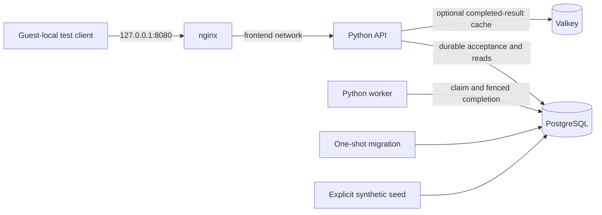

# Containerized service platform

A local reference service that accepts small text-analysis jobs, persists them in
PostgreSQL, and completes them in a separate worker. Valkey caches successful
results; nginx is the only HTTP entry point. The failure exercise stops individual
dependencies and checks what the API can still promise.

This is lab engineering work. The application and container configuration are
implemented; a completed integration report and exact-revision CI are required
before describing the core as tested or released. See the bounded
[acceptance checklist](docs/acceptance.md). No production availability, cloud
deployment, or employment-experience claim is made.



The containers run inside a disposable Ubuntu VM. The VM uses Apple's VZ
hypervisor through pinned Lima; it is neither container emulation nor a cloud
environment. No host Docker context is adopted. The HTTP port belongs to the
guest's loopback interface and is **not forwarded to macOS**.

## Prerequisites and quickstart

Controller checks require Git, Make, Bash, Python **3.14.7**, and outbound HTTPS
for pinned dependencies. Use `python3.14` explicitly on macOS: its system Python
may be too old. Bootstrap installs repository-local tools and a virtual
environment; it does not install global packages.

The real integration profile additionally requires macOS on Apple Silicon with
VZ available. Reserve 2 CPUs, 2 GiB RAM, a 24 GiB sparse guest disk, and several
GiB for downloaded images/build layers. The sparse disk's maximum is not its
initial physical usage. Docker image pulls, guest preparation, and the initial
build need network access. There is no cloud account or paid-service requirement;
network downloads remain subject to the provider's limits. Linux controller CI
does not establish Linux-host VM-provider compatibility.

From this standalone checkout:

```sh
make PYTHON=python3.14 bootstrap
make help
make doctor
make validate
make demo
make security
```

`make demo` is the lightweight controller demonstration, not proof of containers.
The required real lifecycle demonstration is:

```sh
make integration LAB=ops-container-platform-reference
```

The formal profile requires a clean committed checkout and saves
`evidence/<source-revision-first-12>-compose-vm.json`; it refuses to overwrite an
existing report. During implementation, the following runs the same real workflow
against working source and saves timestamped evidence under ignored
`.runtime/evidence`:

```sh
make integration-dev LAB=ops-container-platform-reference
```

A development run cannot satisfy the release proof gate.

This explicit lab target authorizes creating the owned disposable VM, faulting
its services, and deleting its synthetic data during teardown. The controller's
direct CLI defaults to dry-run; the Make target supplies its execution
confirmation. The profile builds the application, runs acceptance assertions,
and attempts teardown on success and failure. Do not replace the target with an
existing Docker context or run this Compose file against a shared engine.

The fleet-provider component is fetched at the exact revision and SHA256 in
`component.lock.json`; no sibling checkout is needed. `provider.lock.json`,
`packages.lock.json`, `engine.lock.json`, `images.lock.json`, and the Python
requirements locks define the remaining inputs. See
[dependency verification and limitations](docs/dependencies.md).

## Expected behavior

The input is JSON containing exactly `text`: nonblank, valid Unicode, no NUL,
at most 4096 UTF-8 bytes. `Idempotency-Key` must be 8–80 letters, digits, `_` or
`-`. The worker returns the UTF-8 SHA256 digest and byte, character, word, and
line counts. Input is never executed as code or interpreted as a path or URL.

| Request | Contract |
| --- | --- |
| `POST /jobs` with JSON and a fresh key | `202`, persisted job ID and current state |
| Repeat that key with the same text | `200`, the original job |
| Repeat that key with different text | `409`, no second job |
| `GET /jobs/<canonical-lowercase-UUID>` | `200` with state/result, or `404` |
| `GET /health/live` | Process liveness, independent of PostgreSQL |
| `GET /health/ready` | `200` only when PostgreSQL and expected schema are available |

Queued work survives a worker stop. A restarted worker claims it from SQL.
PostgreSQL failure makes new acceptance return `503`; the API does not pretend
that work was accepted. Successful results may still be served from the
60-second cache, while readiness remains unavailable. A cache outage falls back
to PostgreSQL. The cache is not a queue or a persistence mechanism.

Read [the walkthrough](docs/demo.md) for what each assertion demonstrates and
[the runbook](docs/runbook.md) for diagnosis and recovery. Example requests are
illustrations of the guest-local API; the integration harness runs the actual
sequence and records its observed results.

## Validation and evidence

`make lint` checks Python, shell scripts, workflow syntax and repository
configuration. `make test` exercises input handling, HTTP behavior, cache
fallback, worker behavior and controller safety. `make validate` composes the
required controller gates. `make security` scans working files, staged content,
and the outgoing Git history. Passing controller fixtures does not satisfy the
real integration acceptance gate.

Keep evidence at its tested revision, including the source fingerprint,
environment, tool versions, command exit codes, assertions and cleanup results.
A documentation-only follow-up commit does not retroactively become the source
revision tested. Failed runs remain failures. Publication, GitHub CI, local
controller validation and VM integration have independent states.

## Security and operational boundaries

Application processes run as UID 10001, Valkey as 999, and nginx as 101. The
PostgreSQL image initializes its data directory before running the database as
its unprivileged account. The migration receives owner credentials; the running
API and worker receive only the application database credential. No database or
cache ports are published. Two internal Compose networks separate the proxy
from the backend services.

Runtime credentials are generated for the disposable run and stored in ignored
private paths. Secrets, guest logs, VM disks, build caches and generated state do
not belong in Git. Logs contain request IDs, route names, status and duration,
not submitted text or credentials. Read [SECURITY.md](SECURITY.md) before adapting
the service beyond synthetic local work.

Resource limits are explicit in `compose.json`: memory, CPU, PIDs, temporary
storage, log rotation and stop grace periods. The runtime profile checks the
actual engine configuration. These are lab limits, not measured capacity or an
availability guarantee.

## Cleanup, limitations and next work

Integration tears down the inventoried Compose project and its owned VM. A
successful test run is insufficient when cleanup reports a failure: retain the
inventory and follow the runbook. `make clean` prints a teardown plan without
deleting resources. Download caches can remain local and ignored after VM
deletion. If VM cleanup fails, inspect the plan and then explicitly confirm only
the inventoried lab:

```sh
make teardown-plan LAB=ops-container-platform-reference
make teardown LAB=ops-container-platform-reference CONFIRM=ops-container-platform-reference
```

Do not use blanket Docker pruning or deletion of unrelated Lima instances.

There is one database and one worker, no replication, backup, user authentication,
tenant isolation, TLS transport, rate-limit policy, retention job or production
rollout strategy. Python's small HTTP server is deliberately a bounded lab
implementation. A 30-second lease is appropriate only for this short deterministic
operation. Work can be computed more than once after a crash, while fenced SQL
completion prevents an expired claimant from committing a result.

Rootless Podman, additional VM providers/architectures, performance testing,
telemetry, encrypted transport and recovery are extensions requiring their own
tests. Later portfolio projects should consume a verified release of this
contract rather than copy the code or assume a sibling directory.

Design details: [architecture](docs/architecture.md),
[SQL queue decision](docs/decisions/001-durable-postgres-queue.md), and
[isolated runtime decision](docs/decisions/0002-owned-vm-runtime.md).
Original code is [MIT licensed](LICENSE); [NOTICE.md](NOTICE.md) records reuse and
third-party boundaries.

The proxy also joins a dedicated `edge` bridge, needed for guest-loopback port
publishing. Only the proxy joins that network; the API, database, worker and cache
remain on internal application networks. The edge permits proxy egress but binds
the single published port to 127.0.0.1, with no forwarding from the VM to macOS.
The proxy health probe performs HTTP through nginx to application readiness. See
[Docker port publishing](https://docs.docker.com/engine/network/port-publishing/)
for the distinction between a bridge and an explicitly loopback-bound port.
