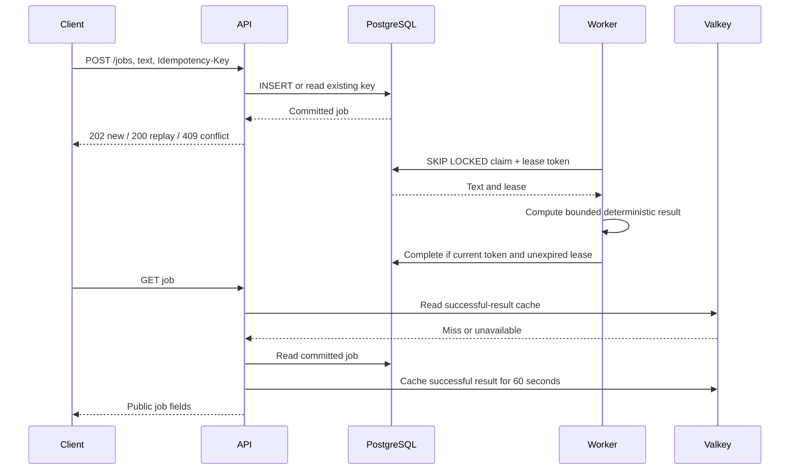

# Architecture

## Acceptance is a database transaction

`opsjobs.api` validates the body and key before calling `Repository.enqueue`.
`opsjobs.database` commits the insert before the handler returns `202`. The SQL
unique constraint on `idempotency_key` arbitrates concurrent repeats; comparing
the content digest distinguishes a retry from reuse for different work. The API
does not put a message in Valkey and then separately insert a database row, so
there is no cross-system commit gap in the acceptance path.

## Worker state and recovery

`Repository.claim` locks a candidate with `FOR UPDATE SKIP LOCKED` and changes it
to `running` in the same transaction. Each claim increments `attempts`, replaces
the UUID lease token and sets a 30-second database-clock expiry. Completion
requires the matching token, `running` state and an unexpired lease. An old
worker cannot overwrite the new claimant's completion.

The worker's operation is a pure function of text. A crash can leave it eligible
for recomputation after lease expiry. At most three claims are allowed; expired
work with three attempts is marked `failed`. This provides bounded at-least-once
attempts and fenced completion, not a general exactly-once side-effect system.
There is no lease renewal because the maximum input is 4096 bytes. External
side effects or long jobs would need a different contract and additional tests.

`SIGTERM` sets a worker event and lets the current short operation return. The
API shuts down its listener and waits for request threads. Socket, database and
proxy timeouts bound routine waits. Compose's init process forwards signals and
reaps children; stop grace periods define when the engine may force termination.
An accepted row remains durable even if the client loses the response and retries
the same key.

## Schema, roles and cache

`opsjobs.migrate` serializes migration transactions with an advisory lock and
records each numbered SQL file's SHA256. Changing or removing an applied
migration is rejected. Add a new migration instead of rewriting history.
`001_jobs.sql` constrains status, attempt count, lease fields and result presence.
The `ops_app` role has the table privileges needed by API/worker, no superuser,
database-creation or role-creation attributes. `ops_owner` is limited to the
database and migration containers by secret selection, but the official image
creates it with initialization authority. This is a local administrative role,
not a model of a tightly separated production database ownership hierarchy.

`opsjobs.seed` uses two fixed synthetic texts and idempotency keys. Repeating it
does not create duplicate jobs. Job UUIDs and timestamps are assigned on first
insertion; deterministic seeds do not mean byte-identical database files.

Only successful terminal results are cached. The API bounds cache values, checks
their job ID/state, and falls back to SQL on cache errors. A hit can be served
during database failure; readiness still tests the database/schema. A caller
cannot infer database health from a cached `GET`. No negative, queued or running
states are cached. A compromised cache is within this lab's trusted backend
boundary and could forge a plausible result; the cache is not cryptographically
authenticated data storage.

## Containers, layers and isolation

`Dockerfile` installs hash-locked wheels in a dependency stage, then copies the
virtual environment into the runtime stage along with source and SQL. The pinned
Python base appears in both stages. Separating `requirements.lock` from source
allows dependency layers to be reused after an application-only edit. There is
no compiler toolchain added by this build, no credential-bearing build argument,
and no registry push.

Compose gives each service its own process and mount namespaces while sharing
the guest kernel. Networks are bridge-backed container network namespaces;
Docker DNS resolves service names. nginx joins only `frontend`; PostgreSQL and
Valkey join only `backend`; the API joins both. The worker needs only `backend`.
Both networks are internal. The guest-local published proxy port is the sole
application ingress. Container namespace isolation does not replace the VM
boundary, and internal networks do not protect against a compromised guest root.

Memory, CPU and PID fields are enforced through Linux cgroups when supported by
the engine; inspection and real integration must establish effective limits.
Most services have a read-only root filesystem with bounded `/tmp` tmpfs,
capabilities dropped and `no-new-privileges`. PostgreSQL needs its writable data
volume and initialization behavior. It persists under `/var/lib/postgresql`,
matching the official PostgreSQL 18 image layout. Restarting a container reuses
that named volume; deleting the confirmed disposable lab intentionally removes
it. Volume persistence is not backup or recovery proof.

## Readiness and observability

PostgreSQL health precedes migration; successful migration precedes application
startup. Initial API startup also waits for cache health, while runtime cache
failure is tolerated. nginx starts after API readiness and resolves the upstream
through Docker DNS so replacement addresses can be discovered. Its process
health check is weaker than end-to-end readiness; the integration client must
also request the API through the proxy.

API logs carry generated request IDs, fixed route names, HTTP status and elapsed
milliseconds. Worker logs carry event names and job IDs. These are useful local
signals, not distributed tracing, an SLO, a benchmark or an alerting system.

The proxy also joins a dedicated `edge` bridge, needed for guest-loopback port
publishing. Only the proxy joins that network; the API, database, worker and cache
remain on internal application networks. The edge permits proxy egress but binds
the single published port to 127.0.0.1, with no forwarding from the VM to macOS.
The proxy health probe performs HTTP through nginx to application readiness. See
[Docker port publishing](https://docs.docker.com/engine/network/port-publishing/)
for the distinction between a bridge and an explicitly loopback-bound port.
